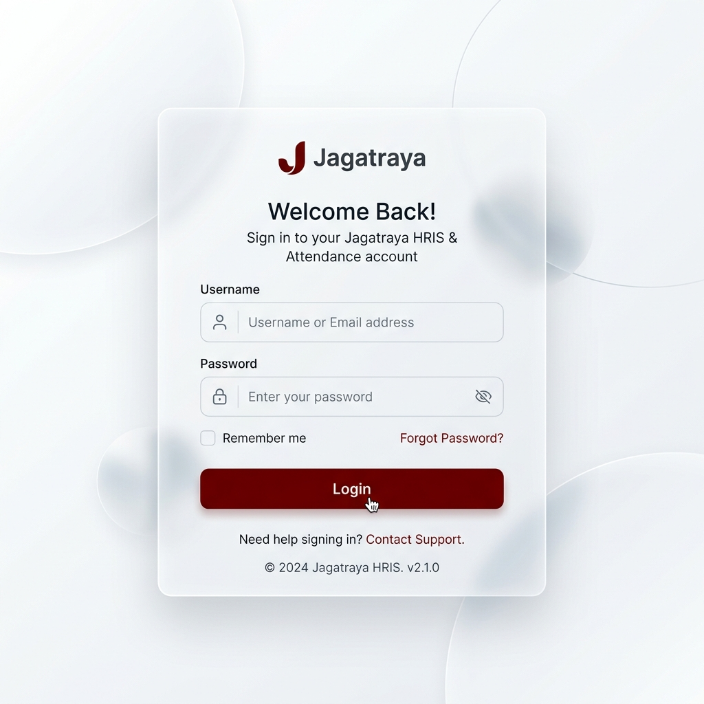
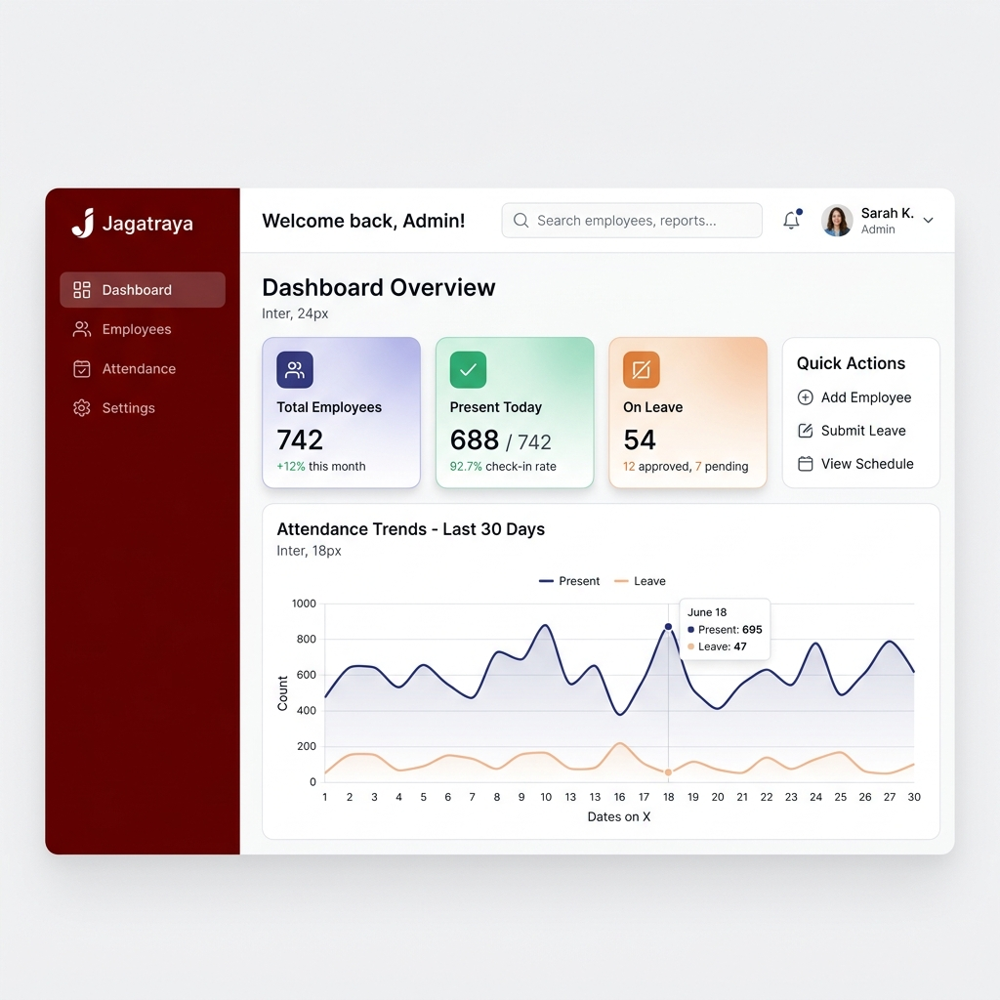
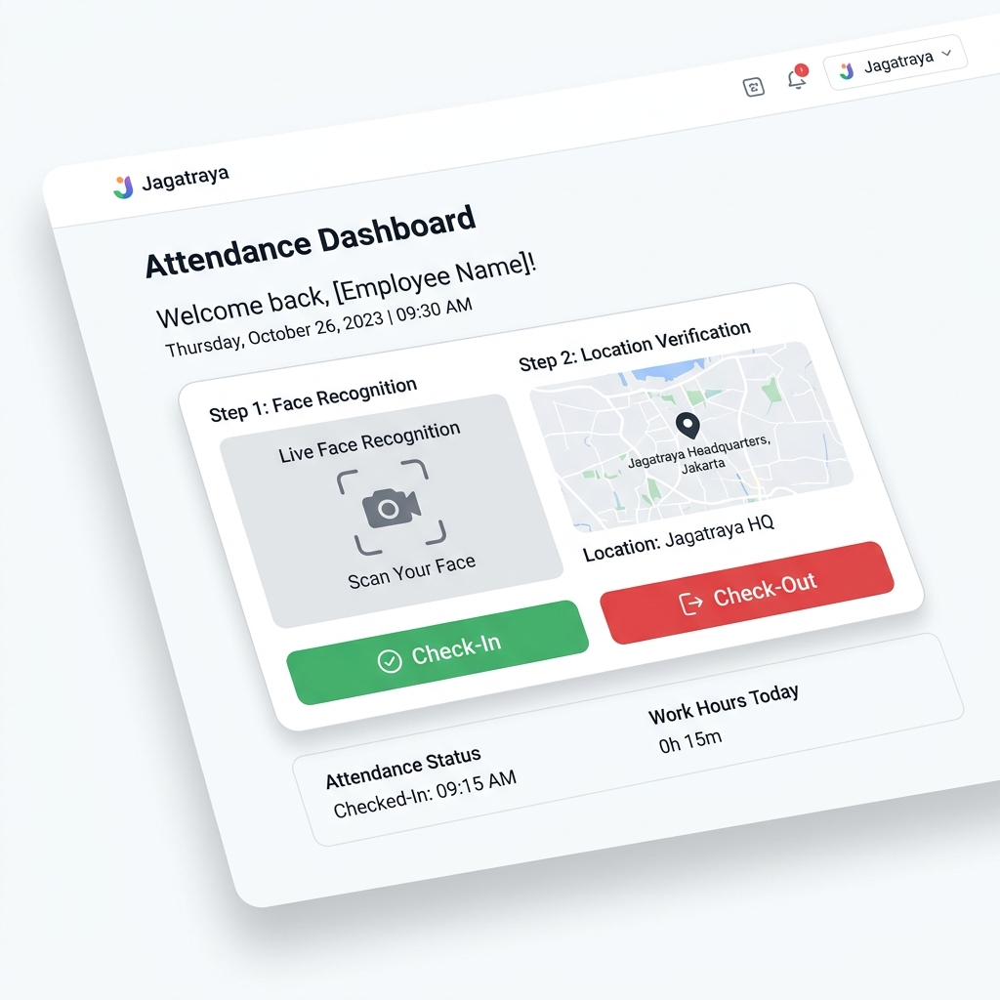

# Buku Panduan Aplikasi Absensi Jagatraya

Buku panduan ini menjelaskan cara penggunaan aplikasi Absensi Jagatraya khusus untuk fitur-fitur yang berkaitan dengan kehadiran (kehadiran, cuti, lembur, dan jadwal kerja). Panduan ini dibagi untuk tiga peran pengguna: Administrator, Manajer, dan Karyawan (User).

---

## 1. Panduan Administrator

Administrator memiliki akses penuh ke seluruh fitur pengaturan sistem absensi, master data, dan laporan kehadiran.

### 1.1. Login dan Pengaturan Awal

- **Login**: Masukkan username dan password administrator pada halaman login.
- **Pengaturan Aplikasi (Settings)**: Masuk ke menu **Pengaturan Aplikasi**. Di sini, Anda wajib mengatur:
  - **Radius Absensi (dalam meter)**: Menentukan jarak maksimal karyawan dari titik lokasi kantor agar bisa melakukan absen.
  - **Toleransi Keterlambatan**: Batas waktu (dalam menit) sebelum karyawan dianggap terlambat setelah jam masuk.
  - **Zona Waktu**: Pastikan zona waktu sesuai dengan lokasi perusahaan.

### 1.2. Master Data (Data Utama)
Sebelum karyawan dapat menggunakan sistem absensi, Administrator harus melengkapi Master Data secara berurutan:
1. **Departemen**: Tambahkan daftar departemen atau divisi di perusahaan.
2. **Jabatan (Posisi)**: Tambahkan daftar jabatan yang ada di tiap departemen.
3. **Lokasi Absensi**: Tentukan titik koordinat (latitude, longitude) kantor atau lokasi proyek di mana karyawan diizinkan melakukan absensi. Anda bisa mendaftarkan banyak lokasi jika perusahaan memiliki banyak cabang.

### 1.3. Manajemen Karyawan dan Pengguna

- **Data Karyawan**: Buka menu **Karyawan**. Tambahkan data karyawan baru, isi informasi personal, serta pilih departemen dan jabatannya. Pastikan untuk mengisi sisa kuota cuti tahunan karyawan.
- **Akun Pengguna (Users)**: Menu **Pengguna** digunakan untuk membuat kredensial login (username dan password) bagi karyawan yang sudah terdaftar. Jangan lupa memberikan peran (role) yang sesuai: `admin`, `manager`, atau `employee`.
- **Pendaftaran Wajah (Face Registration)**: Untuk memvalidasi kehadiran, karyawan harus melakukan *Face Recognition*. Admin dapat membantu mendaftarkan wajah karyawan, atau karyawan dapat melakukannya sendiri. Pastikan pencahayaan terang dan wajah terlihat jelas saat pengambilan foto.

### 1.4. Manajemen Kehadiran dan Jadwal
- **Jadwal Kerja (Work Schedule)**: Atur jadwal kerja/shift karyawan. Tentukan jam masuk dan jam pulang untuk setiap jadwal kerja. Karyawan dapat di-assign ke jadwal yang berbeda-beda.
- **Hari Libur (Off Days)**: Masukkan tanggal merah atau hari libur nasional pada menu ini agar sistem tidak menganggap karyawan mangkir pada hari tersebut.
- **Persetujuan Cuti/Izin (Leaves)**: Administrator memiliki wewenang penuh untuk meninjau, menyetujui, atau menolak pengajuan cuti, sakit, dan izin dari karyawan.
- **Lembur (Overtime)**: Administrator dapat memvalidasi dan menyetujui pengajuan lembur karyawan.

### 1.5. Laporan Absensi
- **Laporan (Reports)**: Menu **Laporan** menyajikan data rekapitulasi kehadiran seluruh karyawan. Anda dapat melihat jam masuk, pulang, durasi kerja aktual, total jam keterlambatan, dan jam lembur. Laporan ini dapat difilter berdasarkan bulan dan dapat diekspor ke Excel/PDF untuk keperluan lebih lanjut.

---

## 2. Panduan Manajer

Manajer (Manager) memiliki hak akses untuk memantau tim/departemennya, serta memiliki otoritas tingkat pertama untuk menyetujui pengajuan absen dari bawahannya.

### 2.1. Persetujuan (Approvals)
- **Cuti, Izin & Lembur**: Masuk ke menu **Persetujuan Manajer (Manager Approvals)**. Jika ada anggota tim di departemennya yang mengajukan cuti, sakit, izin, atau lembur, pengajuan tersebut akan muncul di halaman ini.
- **Aksi Persetujuan**: Manajer dapat meninjau alasan pengajuan, memeriksa sisa kuota cuti karyawan yang bersangkutan (jika cuti), dan memberikan keputusan **Setujui (Approve)** atau **Tolak (Reject)**.

### 2.2. Pemantauan Tim
- Manajer dapat memantau riwayat dan statistik kehadiran (jam kedatangan dan kepulangan) dari anggota tim bawahannya secara langsung melalui *Dashboard* Manajer.

---

## 3. Panduan Karyawan (User)

Karyawan menggunakan aplikasi ini untuk keperluan absensi mandiri, mengajukan perizinan/cuti, dan memantau riwayat kehadiran mereka sendiri.

### 3.1. Login dan Dashboard
- Gunakan *username* dan *password* yang telah diberikan oleh HR/Admin.
- Di **Dashboard**, karyawan dapat melihat:
  - Ringkasan sisa jatah cuti tahunan.
  - Jadwal kerja (jam masuk & jam pulang) untuk hari ini.
  - Status kehadiran hari ini (apakah sudah absen masuk/pulang).
  - Statistik kehadiran di bulan berjalan.

### 3.2. Absensi Harian (Check-In & Check-Out)

- Buka menu **Absensi (Attendance)**.
- **Langkah-langkah Absensi**:
  1. Pastikan **GPS (Location Services)** di HP atau Laptop Anda menyala. Anda harus berada di dalam radius lokasi kantor yang diizinkan.
  2. Sistem akan meminta izin akses ke kamera, pilih **Allow / Izinkan**.
  3. Arahkan wajah Anda ke dalam bingkai kamera yang muncul di layar. Sistem akan melakukan pencocokan wajah secara otomatis (*Face Recognition*).
  4. Jika wajah cocok dan lokasi sesuai, tekan tombol **Check-In** untuk melakukan absen masuk (di awal shift).
  5. Setelah selesai jam kerja, ulangi langkah yang sama lalu tekan **Check-Out** untuk absen pulang.

### 3.3. Mengajukan Cuti, Sakit, dan Izin
- Masuk ke menu **Cuti / Izin (Leaves)**.
- Klik tombol **Ajukan Cuti/Izin Baru**.
- Pilih tipe pengajuan:
  - **Cuti Tahunan**: Akan memotong sisa kuota cuti Anda.
  - **Sakit**: Membutuhkan alasan, sangat disarankan untuk melampirkan foto/scan Surat Keterangan Dokter.
  - **Izin Lainnya**: Untuk keperluan mendesak di hari kerja.
- Tentukan tanggal mulai dan selesai, serta isi alasannya dengan jelas.
- Kirim pengajuan dan statusnya akan menjadi *Pending* hingga disetujui oleh Manajer atau Admin.

### 3.4. Mengajukan Lembur (Overtime)
- Jika Anda diminta untuk bekerja lembur, buka menu **Lembur (Overtime)**.
- Tambahkan pengajuan baru dan isi:
  - Tanggal pelaksanaan lembur.
  - Jam mulai dan jam selesai lembur.
  - Deskripsi/catatan tentang tugas yang dikerjakan selama lembur.
- Pengajuan Anda akan masuk ke antrean persetujuan (approval) atasan.

### 3.5. Melihat Riwayat Kehadiran
- Masuk ke menu **Riwayat (History)**.
- Di sini Anda dapat melihat secara lengkap catatan kehadiran Anda pada bulan-bulan sebelumnya.
- Rincian yang ditampilkan meliputi: jam Anda absen masuk dan absen pulang, total jam kerja di hari tersebut, catatan keterlambatan, dan riwayat status cuti/izin/sakit.
